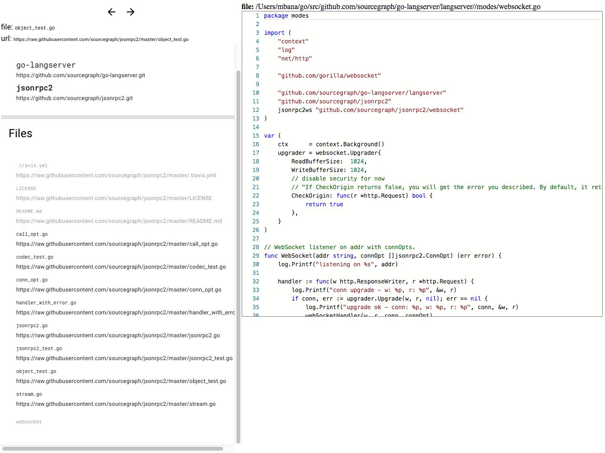
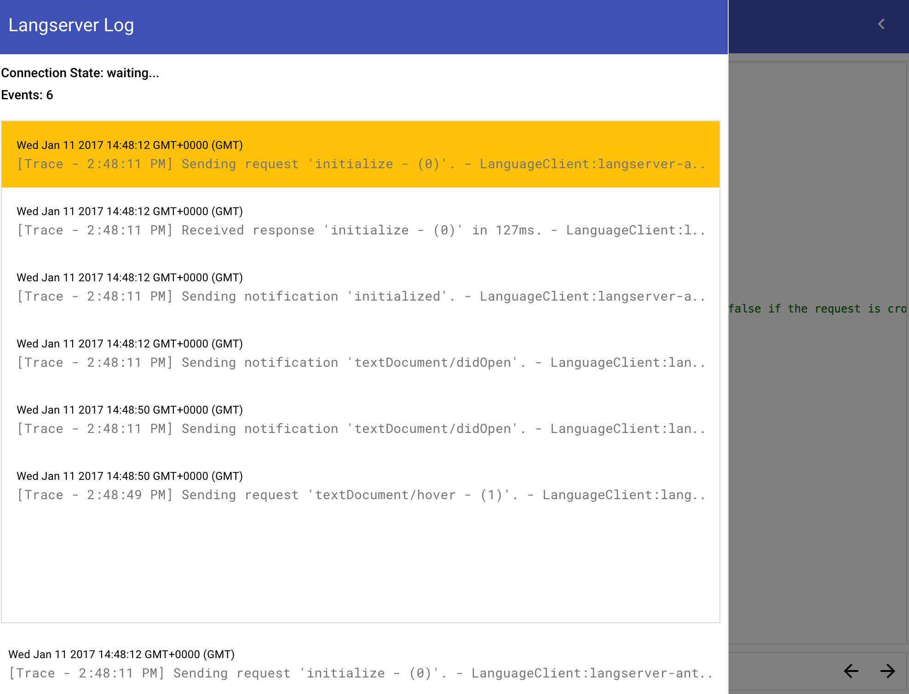
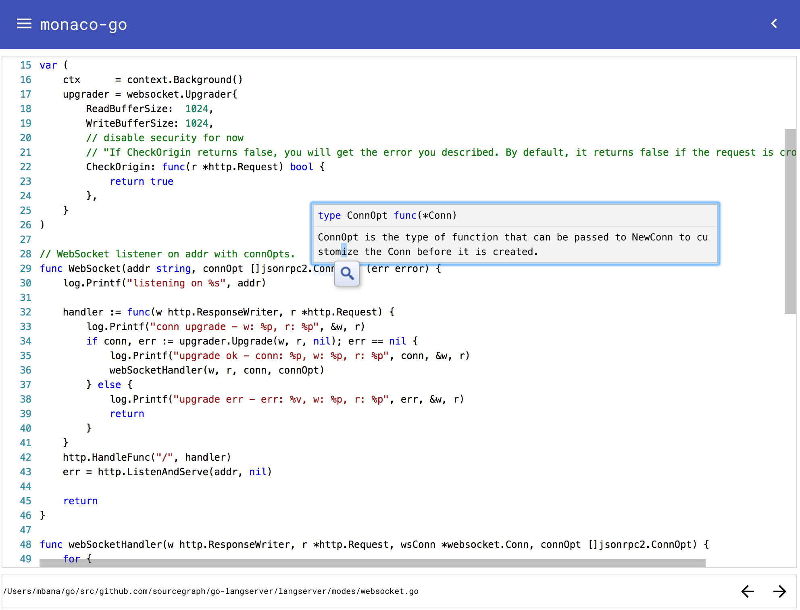
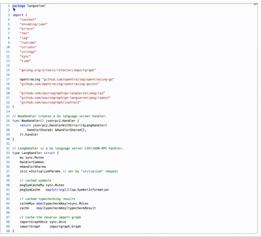

# `monaco-go`

Go lang mode for [monaco-editor](https://github.com/Microsoft/monaco-editor). The implementation is mostly derived from
[monaco-css](https://github.com/Microsoft/monaco-css) but uses WebSocket as the transport to talk to the
[go-langserver](https://github.com/sourcegraph/go-langserver). The below are partly if not partly supported, see [Language Server Protocol](https://github.com/Microsoft/language-server-protocol/blob/master/protocol.md#messages-overview):

* `capabilities.textDocumentSync`
* `textDocument/didChange`
* `textDocument/didClose`
* `textDocument/didOpen`
* `textDocument/hover`
* `textDocument/definition`: going to definition works but navigating back and
forths isn't.
* `textDocument/references`: references are listed, navigating to them however isn't.
* `textDocument/publishDiagnostics`
* `textDocument/documentSymbol`
* `textDocument/rename`: WIP.
* <del>`workspace/symbol`</del>: fairly large feature-set, i think.

## azure live example

live running version of `monaco-go` talking to the `go-langserver` using a
WebSocket at go-langserver.cloudapp.net:

`monaco-go`:

* <http://azure.bana.io/monaco-go/>
* <del><http://go-langserver.cloudapp.net/monaco-go/></del>
* <del><http://13.65.101.250:8080/monaco-go/></del>

`go-langserver`:

* <ws://azure.bana.io:4389>
* <del><ws://go-langserver.cloudapp.net:4389></del>
* <del><ws://13.65.101.250:4389></del>

**todo:** will setup a domain for the `go-langserver`.

### screenshot



.

## `monaco`

more available in [./README.md](./README.md#screenshots) .

### `textDocument/hover`



### `textDocument/definition`



## build

more info: [./build/README.md](./build/README.md).

### Docker

#### `Dockerfile`

execute below to download the repo, build and then run.
you need [Docker](https://www.docker.com/):

```sh
( \
  wget -qO- https://raw.githubusercontent.com/mbana/monaco-go/master/build/get.sh | /bin/bash \
) && \
docker run -p 8080:8080 -it monaco-go:latest
```

See [build output](./build/README.md#build-output) for what logs you should expect to see.

#### Docker Hub

An image containing the fork of
[go-langserver](https://github.com/sourcegraph/go-langserver), [mbana/go-langserver](https://github.com/mbana/go-langserver), that has the WebSocket mode is at
<https://hub.docker.com/r/mohamedbana/go-langserver/>.

```sh
docker run -p 8080:8080 -p 4389:4389 -it mohamedbana/go-langserver:latest
```

later...

```sh
Unable to find image 'mohamedbana/go-langserver:latest' locally
latest: Pulling from mohamedbana/go-langserver
Digest: sha256:91f6d7b0841df53e455b5d7712d664db85b727f80b12b7969dc7b418aea79a31
Status: Downloaded newer image for mohamedbana/go-langserver:latest
langserver-go:ws:listening on :4389

> monaco-go@1.2.1 serve /Users/mbana/monaco-go
> http-server -c-1 --utc

Starting up http-server, serving ./
Available on:
  http://127.0.0.1:8080
  http://172.17.0.2:8080
Hit CTRL-C to stop the server
```

see: <https://hub.docker.com/r/mohamedbana/go-langserver/tags/>.

### locally

or, although not ideal:

```sh
( \
  REPOS_DIR="/tmp/repos/ghub" && \
  mkdir -p $REPOS_DIR && \
  cd $REPOS_DIR && \
  git clone --recursive git@github.com:mbana/monaco-go.git && \
  cd monaco-go && \
  ./build/all.sh \
)
```

## References

* [`monaco-editor`](https://github.com/Microsoft/monaco-editor).
* [`vscode-css-languageservice`](https://github.com/Microsoft/vscode-css-languageservice).
* [`monaco.d.ts`](https://github.com/Microsoft/monaco-css/blob/master/src/monaco.d.ts).
* [Visual Studio Code](https://github.com/Microsoft/vscode).
* `build`: [/build/README.md](/build/README.md).
* `Dockerfile`: [/build/docker/README.md](/build/docker/README.md).

## License

[MIT](https://github.com/Microsoft/monaco-css/blob/master/LICENSE.md)