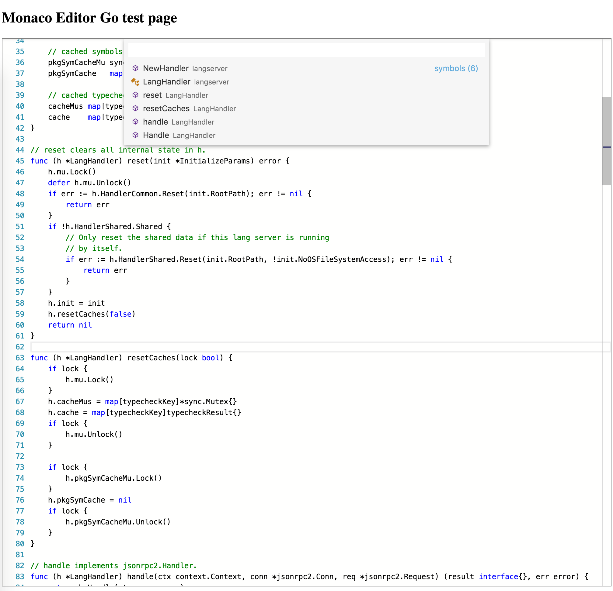
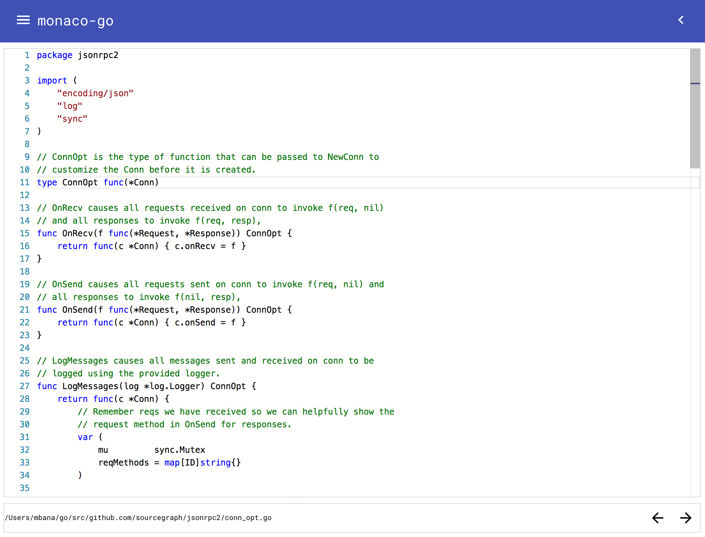
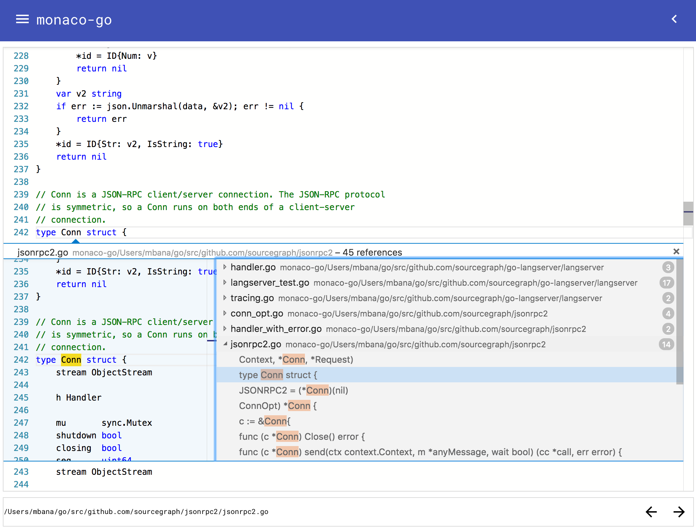
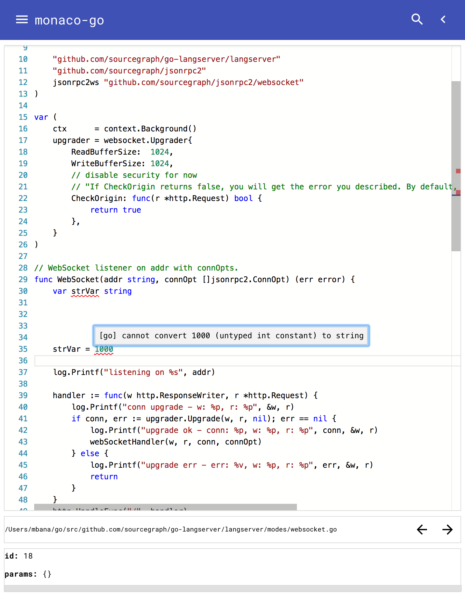
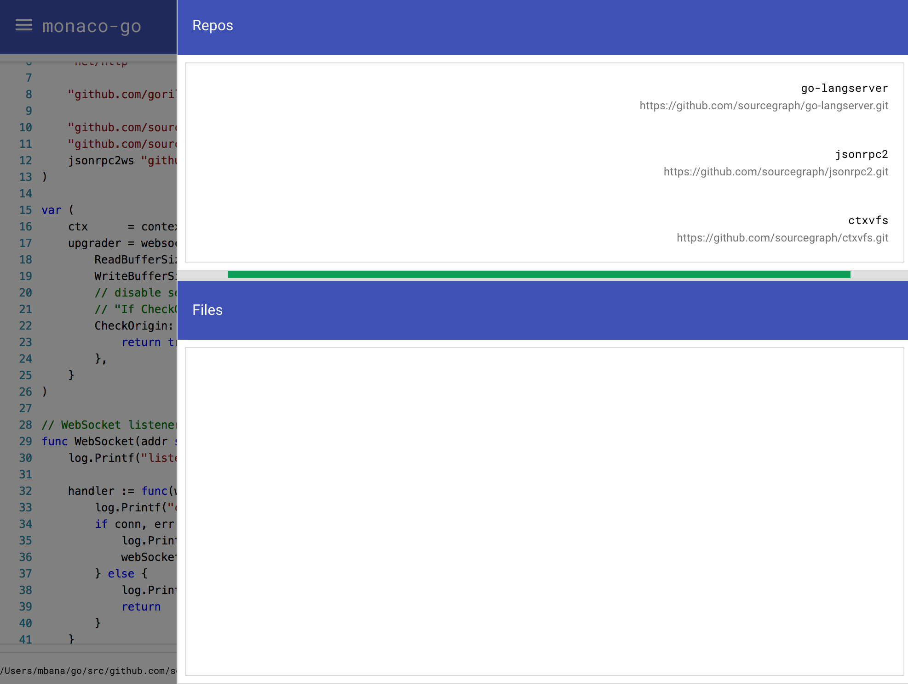

# `monaco-go`

Go lang mode for [monaco-editor](https://github.com/Microsoft/monaco-editor). The implementation is mostly derived from
[monaco-css](https://github.com/Microsoft/monaco-css) but uses WebSocket as the transport to talk to the
[go-langserver](https://github.com/sourcegraph/go-langserver). The below are fully, if not partly, supported, see [Language Server Protocol](https://github.com/Microsoft/language-server-protocol/blob/master/protocol.md#messages-overview):

* `capabilities.textDocumentSync`
* `textDocument/didChange`
* `textDocument/didClose`
* `textDocument/didOpen`
* `textDocument/hover`
* `textDocument/definition`: going to definition works but navigating back and
forths isn't.
* `textDocument/references`: references are listed, navigating to them however isn't.
* `textDocument/publishDiagnostics`
* `textDocument/documentSymbol`
* `textDocument/rename`: WIP.
* <del>`workspace/symbol`</del>: fairly large feature-set, i think.

## azure live example

live running version of `monaco-go` talking to the `go-langserver` using a
WebSocket at <https://cloud.bana.io/monaco-go/> (go-langserver.cloudapp.net):

`monaco-go`:

* <https://cloud.bana.io/monaco-go/>, legacy <http://cloud.bana.io/monaco-go/>

`go-langserver`:

* <wss://cloud.bana.io:4389>, legacy <ws://cloud.bana.io:4389>

### changes/notes:

#### ssl - http/2
after moving to SSL so that the server can use http/2 sometimes the requests
either take a while to respond, or it doesn't even respond at all. i'm not sure
if this is an issue with the multi-container setup or the code itself. you can
view the logs remotely using:

```sh
curl https://cloud.bana.io/logs/go-lanserver/go-langserver.log
```

or if you've built it locally:

```sh
docker exec -it monaco-go_nginx-up sh -c 'tail -f /Users/mbana/monaco-go/go-langserver.log'
```

if it still doesn't work, please try again in a while. i've resolve this once
i can get to the root cause of the problem.

#### images

currently the images are built from `ubuntu:14.04` bar the `mohamedbana/monaco-go_nginx` image which is uses
`FROM nginx:1.10-alpine` as the base. i will start moving the rest of the images to a more light-weight distro, maybe
`alpine` or `debain`. this should reduce the build and fetch times.

### screenshot


## `textDocument/hover`


## `textDocument/documentSymbol`



## `textDocument/definition`


**todo:** make animated gif of new interface.

<!---->

## `textDocument/references`



## `textDocument/publishDiagnostics`



## misc




<!--more available in [./docs/EXAMPLES.md](./docs/EXAMPLES.md#screenshots)-->

## todo/issues:

* setup HTTP/2 so that the editor can be hosted on it; should improve
performance dramatically.
* split `go-langserver` into a different container; one for the serving the
custom-built `monaco-editor` and another container providing the WebSocket
support.
* possibly allow spawning the `go-langserver` container from `monaco-go`.

TODO: move to [./docs/TODO.md](./docs/TODO.md).

## build

the script to start <https://cloud.bana.io/monaco-go/> is available at:

```sh
( \
  CONT_START="https://raw.githubusercontent.com/mbana/monaco-go/master/scripts/azure-container-start.sh"; \
  wget --no-cache -qO- $CONT_START | /bin/sh \
) && \
docker run -p 8080:8080 -p 4389:4389 -it mohamedbana/monaco-go:latest
```

if you're running on, say, azure it will fetch/update what's required to start
the site.

<del>more info: [./build/README.md](./build/README.md).</del>

### `Dockerfile`

execute below to download the repo, build and then run.
you need [Docker](https://www.docker.com/):

```sh
( \
  wget -qO- https://raw.githubusercontent.com/mbana/monaco-go/master/build/get.sh | /bin/bash \
) && \
docker run -p 8080:8080 -it monaco-go:latest
```

See [build output](./build/README.md#build-output) for what logs you should expect to see.

#### Docker Hub

##### images

the following images are available in the hub - see [./scripts/publish-docker.sh](./scripts/publish-docker.sh).

* mohamedbana/base-langserver:latest
* mohamedbana/base-go-langserver:latest
* mohamedbana/go-langserver:latest
* mohamedbana/monaco-go:latest

##### run all

An image containing the fork of
[go-langserver](https://github.com/sourcegraph/go-langserver), [mbana/go-langserver](https://github.com/mbana/go-langserver), that has the WebSocket mode is at
<https://hub.docker.com/r/mohamedbana/go-langserver/>.

```sh
docker run -p 8080:8080 -p 4389:4389 -it mohamedbana/go-langserver:latest
```

later...

```sh
Unable to find image 'mohamedbana/go-langserver:latest' locally
latest: Pulling from mohamedbana/go-langserver
Digest: sha256:91f6d7b0841df53e455b5d7712d664db85b727f80b12b7969dc7b418aea79a31
Status: Downloaded newer image for mohamedbana/go-langserver:latest
langserver-go:ws:listening on :4389

> monaco-go@1.2.1 serve /Users/mbana/monaco-go
> http-server -c-1 --utc

Starting up http-server, serving ./
Available on:
  http://127.0.0.1:8080
  http://172.17.0.2:8080
Hit CTRL-C to stop the server
```

see: <https://hub.docker.com/r/mohamedbana/go-langserver/tags/>.

### locally

or, although not ideal:

```sh
( \
  REPOS_DIR="/tmp/repos/ghub" && \
  mkdir -p $REPOS_DIR && \
  cd $REPOS_DIR && \
  git clone --recursive git@github.com:mbana/monaco-go.git && \
  cd monaco-go && \
  ./build/all.sh \
)
```

## References

* [`monaco-editor`](https://github.com/Microsoft/monaco-editor).
* [`vscode-css-languageservice`](https://github.com/Microsoft/vscode-css-languageservice).
* [`monaco.d.ts`](https://github.com/Microsoft/monaco-css/blob/master/src/monaco.d.ts).
* [Visual Studio Code](https://github.com/Microsoft/vscode).
* `build`: [/build/README.md](/build/README.md).
* `Dockerfile`: [/build/docker/README.md](/build/docker/README.md).

## License

[MIT](https://github.com/Microsoft/monaco-css/blob/master/LICENSE.md)