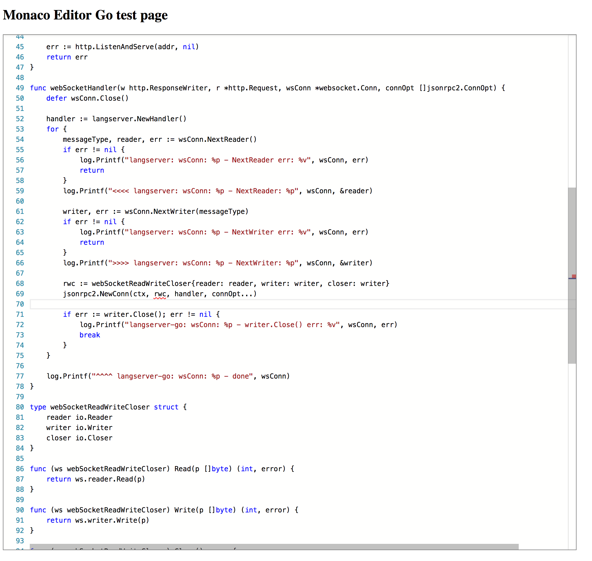
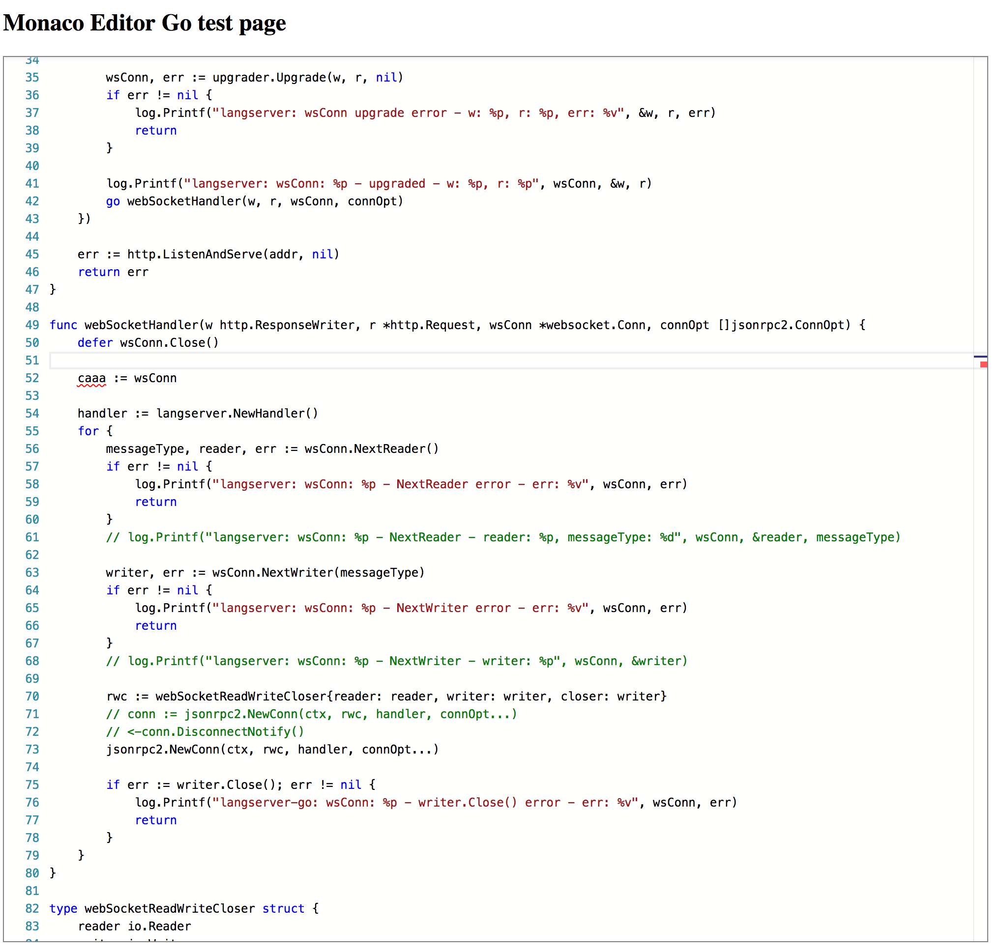
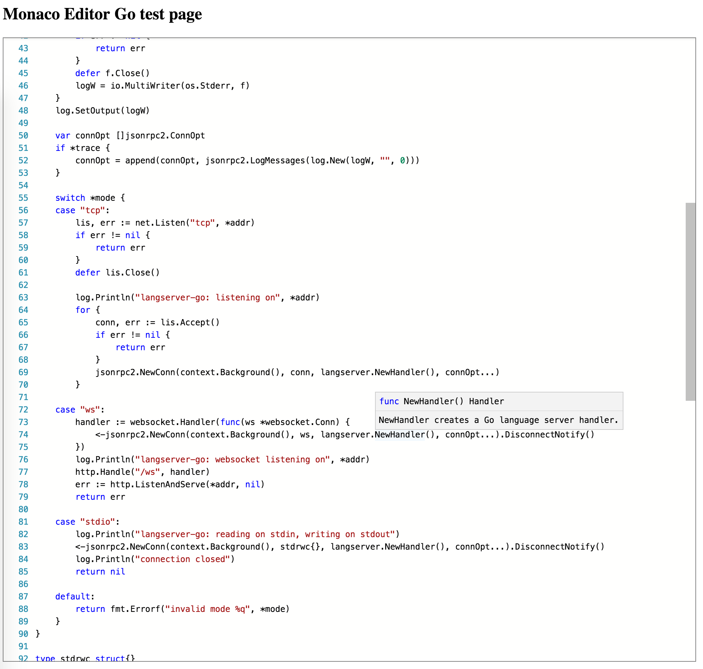

# intro

## preview

### `textDocument/references`

### `textDocument/documentSymbol`

### `textDocument/publishDiagnostics`

Errors are highlighted in the margins and inline, at error site, within model:

### `textDocument/definition`

### `textDocument/hover`

---

## demo

TODO: live demo links...

---

## build

TODO: link to `Dockerfile`?
