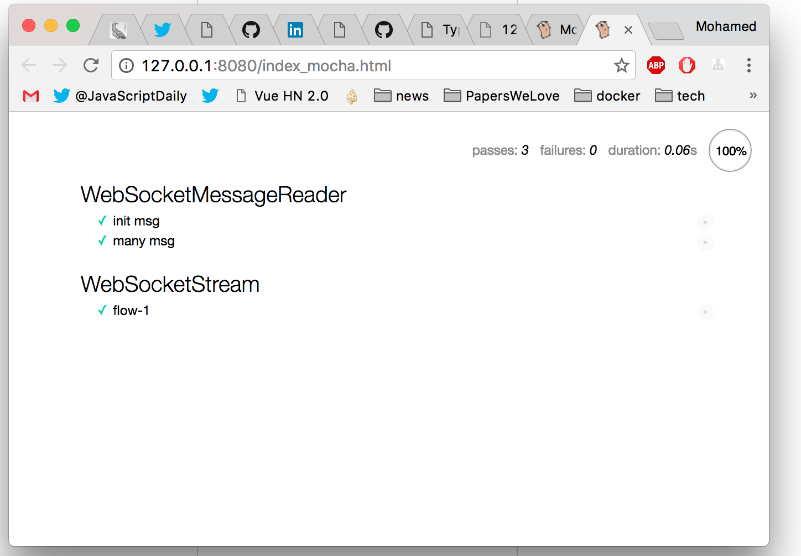

# test

WIP: the tests load the entire dependency tree into the browser, so it's almost
if is you're testing the actual thing. i've tried to avoid mocking where
i can.

i will start doing a full end-to-end tests if it doesn't consume too much
time. for now, though, see,

**entrypoint:**

* [/index_mocha.html](/index_mocha.html)

**test suites:**

* [/src/test/web-socket-reader-test.ts](/src/test/web-socket-reader-test.ts)
* [/src/test/web-socket-stream-test.ts](/src/test/web-socket-stream-test.ts)

**test flow, i.e., init, open, hover, definition:**

* [/src/test/messages/flow-1.log](/src/test/messages/flow-1.log)
* [/src/test/messages/flow-1.ts](/src/test/messages/flow-1.ts)
* [/src/test/messages/messages.ts](/src/test/messages/messages.log)
* [/src/test/messages/test-message.ts.ts](/src/test/messages/test-message.ts.log)

## run

```sh
npm run test
```
### screenshot



### output

```sh
$ npm run test
[00:07:48] Using gulpfile ~/dev/vscode/mbana/monaco-go/gulpfile.js
[00:07:48] Starting 'clean-release'...
[00:07:48] Starting 'clean-out'...
[00:07:48] Finished 'clean-release' after 17 ms
[00:07:48] Finished 'clean-out' after 18 ms
[00:07:48] Starting 'compile'...
src/fillers/vscode-nls.ts(6,63): error TS2307: Cannot find module 'vscode-nls'.
[00:07:50] TypeScript: 1 semantic error
[00:07:50] TypeScript: emit succeeded (with errors)
[00:07:50] Finished 'compile' after 2.68 s
[00:07:50] Starting 'release'...
Starting up http-server, serving ./
Available on:
  http://127.0.0.1:8080
  http://192.168.0.2:8080
Hit CTRL-C to stop the server
[Tue, 20 Dec 2016 00:07:53 GMT] "GET /" "Mozilla/5.0 (Macintosh; Intel Mac OS X 10_11_6) AppleWebKit/537.36 (KHTML, like Gecko) Chrome/55.0.2883.95 Safari/537.36"
[Tue, 20 Dec 2016 00:07:53 GMT] "GET /node_modules/monaco-editor-core/dev/vs/editor/editor.main.css" "Mozilla/5.0 (Macintosh; Intel Mac OS X 10_11_6) AppleWebKit/537.36 (KHTML, like Gecko) Chrome/55.0.2883.95 Safari/537.36"
[Tue, 20 Dec 2016 00:07:53 GMT] "GET /demo/require-paths.js" "Mozilla/5.0 (Macintosh; Intel Mac OS X 10_11_6) AppleWebKit/537.36 (KHTML, like Gecko) Chrome/55.0.2883.95 Safari/537.36"
[Tue, 20 Dec 2016 00:07:53 GMT] "GET /node_modules/monaco-editor-core/dev/vs/loader.js" "Mozilla/5.0 (Macintosh; Intel Mac OS X 10_11_6) AppleWebKit/537.36 (KHTML, like Gecko) Chrome/55.0.2883.95 Safari/537.36"
[Tue, 20 Dec 2016 00:07:53 GMT] "GET /node_modules/monaco-editor-core/dev/vs/editor/editor.main.nls.js" "Mozilla/5.0 (Macintosh; Intel Mac OS X 10_11_6) AppleWebKit/537.36 (KHTML, like Gecko) Chrome/55.0.2883.95 Safari/537.36"
[Tue, 20 Dec 2016 00:07:53 GMT] "GET /node_modules/monaco-editor-core/dev/vs/editor/editor.main.js" "Mozilla/5.0 (Macintosh; Intel Mac OS X 10_11_6) AppleWebKit/537.36 (KHTML, like Gecko) Chrome/55.0.2883.95 Safari/537.36"
[Tue, 20 Dec 2016 00:07:53 GMT] "GET /demo/fillers.js" "Mozilla/5.0 (Macintosh; Intel Mac OS X 10_11_6) AppleWebKit/537.36 (KHTML, like Gecko) Chrome/55.0.2883.95 Safari/537.36"
[Tue, 20 Dec 2016 00:07:53 GMT] "GET /demo/monaco-go.js" "Mozilla/5.0 (Macintosh; Intel Mac OS X 10_11_6) AppleWebKit/537.36 (KHTML, like Gecko) Chrome/55.0.2883.95 Safari/537.36"
[Tue, 20 Dec 2016 00:07:53 GMT] "GET /go/src/github.com/sourcegraph/go-langserver/langserver/modes/websocket.go" "Mozilla/5.0 (Macintosh; Intel Mac OS X 10_11_6) AppleWebKit/537.36 (KHTML, like Gecko) Chrome/55.0.2883.95 Safari/537.36"
[Tue, 20 Dec 2016 00:07:53 GMT] "GET /node_modules/monaco-languages/release/src/monaco.contribution.js" "Mozilla/5.0 (Macintosh; Intel Mac OS X 10_11_6) AppleWebKit/537.36 (KHTML, like Gecko) Chrome/55.0.2883.95 Safari/537.36"
[Tue, 20 Dec 2016 00:07:53 GMT] "GET /release/dev/monaco.contribution.js" "Mozilla/5.0 (Macintosh; Intel Mac OS X 10_11_6) AppleWebKit/537.36 (KHTML, like Gecko) Chrome/55.0.2883.95 Safari/537.36"
[Tue, 20 Dec 2016 00:07:53 GMT] "GET /node_modules/monaco-languages/release/src/go.js" "Mozilla/5.0 (Macintosh; Intel Mac OS X 10_11_6) AppleWebKit/537.36 (KHTML, like Gecko) Chrome/55.0.2883.95 Safari/537.36"
[Tue, 20 Dec 2016 00:07:53 GMT] "GET /release/dev/goMode.js" "Mozilla/5.0 (Macintosh; Intel Mac OS X 10_11_6) AppleWebKit/537.36 (KHTML, like Gecko) Chrome/55.0.2883.95 Safari/537.36"
[Tue, 20 Dec 2016 00:07:54 GMT] "GET /node_modules/monaco-editor-core/dev/vs/base/worker/workerMain.js" "Mozilla/5.0 (Macintosh; Intel Mac OS X 10_11_6) AppleWebKit/537.36 (KHTML, like Gecko) Chrome/55.0.2883.95 Safari/537.36"
[Tue, 20 Dec 2016 00:07:54 GMT] "GET /node_modules/vscode-languageclient/lib/main.js" "Mozilla/5.0 (Macintosh; Intel Mac OS X 10_11_6) AppleWebKit/537.36 (KHTML, like Gecko) Chrome/55.0.2883.95 Safari/537.36"
[Tue, 20 Dec 2016 00:07:54 GMT] "GET /out/fillers/vscode.js" "Mozilla/5.0 (Macintosh; Intel Mac OS X 10_11_6) AppleWebKit/537.36 (KHTML, like Gecko) Chrome/55.0.2883.95 Safari/537.36"
[Tue, 20 Dec 2016 00:07:54 GMT] "GET /node_modules/vscode-languageserver-types/lib/main.js" "Mozilla/5.0 (Macintosh; Intel Mac OS X 10_11_6) AppleWebKit/537.36 (KHTML, like Gecko) Chrome/55.0.2883.95 Safari/537.36"
[Tue, 20 Dec 2016 00:07:54 GMT] "GET /node_modules/vscode-languageclient/node_modules/vscode-jsonrpc/lib/main.js" "Mozilla/5.0 (Macintosh; Intel Mac OS X 10_11_6) AppleWebKit/537.36 (KHTML, like Gecko) Chrome/55.0.2883.95 Safari/537.36"
[Tue, 20 Dec 2016 00:07:54 GMT] "GET /out/fillers/vscode/monaco-window.js" "Mozilla/5.0 (Macintosh; Intel Mac OS X 10_11_6) AppleWebKit/537.36 (KHTML, like Gecko) Chrome/55.0.2883.95 Safari/537.36"
[Tue, 20 Dec 2016 00:07:54 GMT] "GET /out/fillers/vscode/monaco-languages.js" "Mozilla/5.0 (Macintosh; Intel Mac OS X 10_11_6) AppleWebKit/537.36 (KHTML, like Gecko) Chrome/55.0.2883.95 Safari/537.36"
[Tue, 20 Dec 2016 00:07:54 GMT] "GET /out/fillers/vscode/monaco-workspace.js" "Mozilla/5.0 (Macintosh; Intel Mac OS X 10_11_6) AppleWebKit/537.36 (KHTML, like Gecko) Chrome/55.0.2883.95 Safari/537.36"
[Tue, 20 Dec 2016 00:07:54 GMT] "GET /out/fillers/vscode/monaco-text-document.js" "Mozilla/5.0 (Macintosh; Intel Mac OS X 10_11_6) AppleWebKit/537.36 (KHTML, like Gecko) Chrome/55.0.2883.95 Safari/537.36"
[Tue, 20 Dec 2016 00:07:54 GMT] "GET /out/fillers/vscode/monaco-output-channel.js" "Mozilla/5.0 (Macintosh; Intel Mac OS X 10_11_6) AppleWebKit/537.36 (KHTML, like Gecko) Chrome/55.0.2883.95 Safari/537.36"
[Tue, 20 Dec 2016 00:07:54 GMT] "GET /out/fillers/vscode/monaco-position.js" "Mozilla/5.0 (Macintosh; Intel Mac OS X 10_11_6) AppleWebKit/537.36 (KHTML, like Gecko) Chrome/55.0.2883.95 Safari/537.36"
[Tue, 20 Dec 2016 00:07:54 GMT] "GET /out/fillers/vscode/monaco-diagnostic.js" "Mozilla/5.0 (Macintosh; Intel Mac OS X 10_11_6) AppleWebKit/537.36 (KHTML, like Gecko) Chrome/55.0.2883.95 Safari/537.36"
[Tue, 20 Dec 2016 00:07:54 GMT] "GET /node_modules/lodash/lodash.js" "Mozilla/5.0 (Macintosh; Intel Mac OS X 10_11_6) AppleWebKit/537.36 (KHTML, like Gecko) Chrome/55.0.2883.95 Safari/537.36"
```